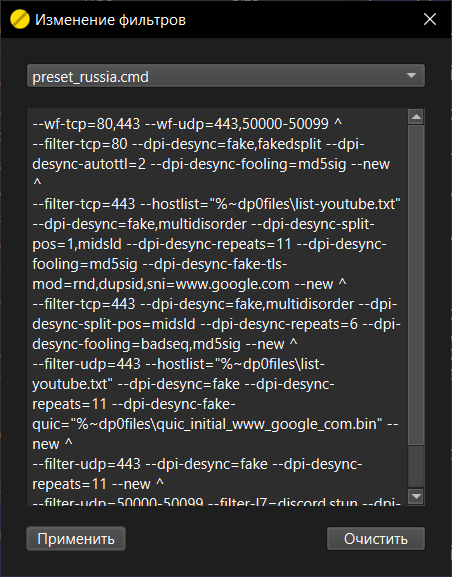

# zapretGUI

Данный проект представляет собой графический пользовательский интерфейс (GUI) для программы [zapret](https://github.com/bol-van/zapret), являющимся автономным средством противодействия DPI, не требующим подключения каких-либо сторонних серверов.

## Описание

Графический интерфейс позволяет настраивать и управлять функциями zapret без необходимости использования командной строки, делая программу более доступной для пользователей без технических навыков.

## Основные возможности

- Управление всеми параметрами zapret через графический интерфейс
- Быстрое включение/отключение противодействия DPI
- Автозапуск zapret при старте системы

## Требования

- Windows 10/11 64-разрядная

## Установка

1. Скачайте последнюю версию GUI со [страницы релиза](https://github.com/noperezoso/zapretGUI/releases/latest)
2. Распакуйте архив в удобное место (желательно, чтобы в пути не было кириллицы)
3. Запустите исполняемый файл zapretGUI.exe

## Использование

Главное окно - zapretGUI:

- Запустить/Обновить - скачивание последней версии zapret и полная замена текущей версии, если таковая имеется
- Фильтры - изменение параметров запуска zapret
- Служба/Задача - блоки, в которых изменяется состояние работы программы в соответствии с типом в названии

Фильтры - Изменение фильтров:

- Выпадающий список - файлы со встроенными стратегиями
- Текстовое поле - полученные из файла строки аргументов для zapret, которые можно доработать перед применением
- Применить - сохраняет строки из текстового поля для дальнейших действий
- Очистить - очищает текстовое поле

## Быстрый старт

В главном окне zapretGUI:
1. Нажать кнопку [Установить] и дождаться изменения текста кнопки на "Обновить"
2. Открыть окно для изменения фильтров, нажав [Фильтры]
3. В выпадающем списке выбрать нужный файл со стратегиями (например, preset_russia.cmd)
4. Нажать кнопку [Применить] и после этого закрыть окно
5. В блоке "Служба" нажать [Создать], а после - [Запустить]

## TDs
- Экран первого запуска программы
- Проверка наличия обновлений zapretGUI и zapret
- Объединение блоков "Служба" и "Задача" в один в главном окне
- Поддержка разных кодировок для открытия файла в окне "Фильтры"
- Открытие внешнего файла со стратегиями в окне "Фильтры"
- Проверка блокировки ресурсов и получение доступных стратегий в отдельном окне
- Рефакторинг кода и интерфейса
- Поддержка Windows 7, 8, 8.1 в виде отдельных сборок

## Благодарности

Выражаем благодарность [bol-van](https://github.com/bol-van) за создание оригинальной программы [zapret](https://github.com/bol-van/zapret)

## Лицензия

Данный проект распространяется под лицензией GNU AGPLv3. [LICENSE](https://github.com/noperezoso/zapretGUI/blob/main/LICENSE)
